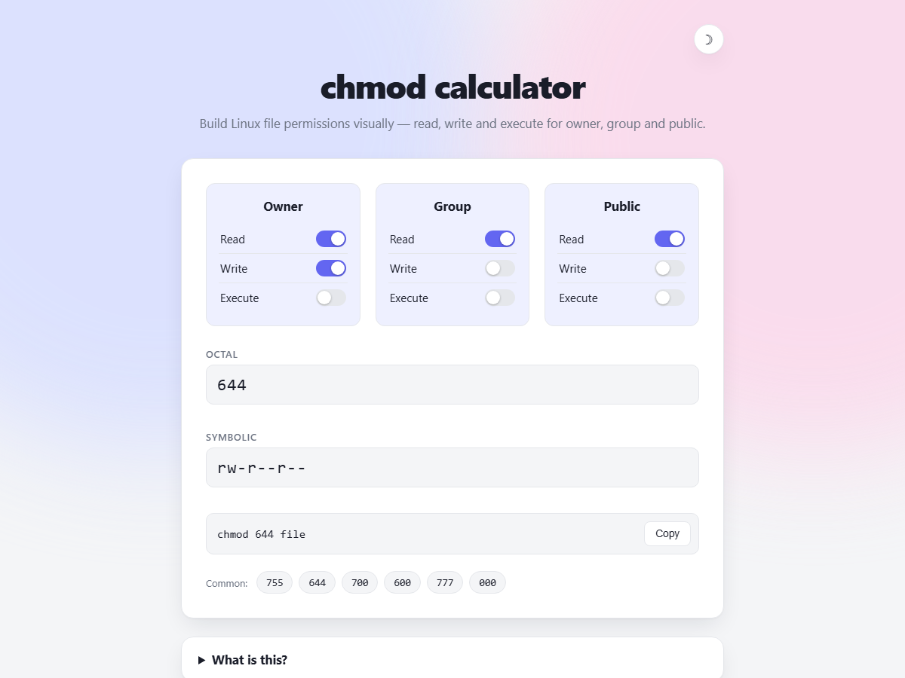
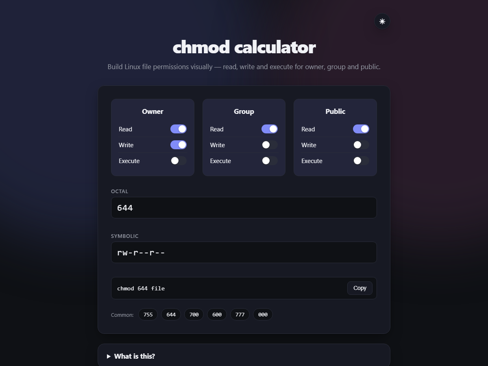

<div align="center">

# 🔐 chmod calculator

**A fast, dependency-free tool for building Linux file permissions — visually.**

Toggle switches, watch octal and symbolic notation update instantly, copy the command, done.


</div>

---

<p align="center">
  
  
</p>

---

## ✨ Features

| | |
|---|---|
| 🎚️ **Visual toggles** | Flip switches per class (owner/group/public) and permission (read/write/execute) |
| 🔄 **Two-way sync** | Checkboxes, octal (`755`) and symbolic (`rwxr-xr-x`) notation all stay in sync — edit any one |
| 📋 **Copy-ready command** | Live `chmod NNN file` preview with a one-click copy button |
| ⚡ **Presets** | Common modes (`755`, `644`, `700`, `600`, `777`, `000`) one tap away |
| 🌗 **Light & dark themes** | Follows your system preference and remembers your choice |
| 🎨 **Subtle motion** | Soft animated background accents, automatically disabled for `prefers-reduced-motion` |
| ♿ **Accessible** | Proper labels, focus states, and keyboard support throughout |
| 🪶 **Zero dependencies** | One self-contained `index.html` — no npm install, no bundler, no CDN |

## 🚀 Quick start

No build step, no server required.

```bash
git clone https://github.com/niruxx/Linux-Attributes-Calculator.git
cd Linux-Attributes-Calculator
```

Then just open `index.html` in a browser — or serve it if you prefer:

```bash
npx serve .
```

## 🧠 How permissions work

Linux permissions are tracked per **class** (owner, group, public) and per **action** (read, write, execute), each with an octal weight:

| Permission | Symbol | Value |
|---|:---:|:---:|
| Read | `r` | 4 |
| Write | `w` | 2 |
| Execute | `x` | 1 |

Sum the values you want for each class to get its digit — e.g. read + write = `6`. Three digits (owner, group, public) give you the full octal mode, like `chmod 644 file`, which is equivalent to `-rw-r--r--` in symbolic form. This tool handles that math for you in both directions.

## 🛠️ Development

The entire app lives in [`index.html`](index.html) — plain HTML, CSS custom properties, and vanilla JavaScript. Edit the file and refresh your browser; there's nothing to install or compile.

## 🤝 Contributing

Issues and pull requests are welcome. Since this is a single static file, most changes are just editing `index.html` and reloading.
